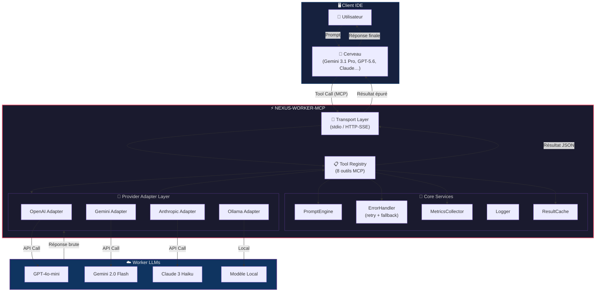
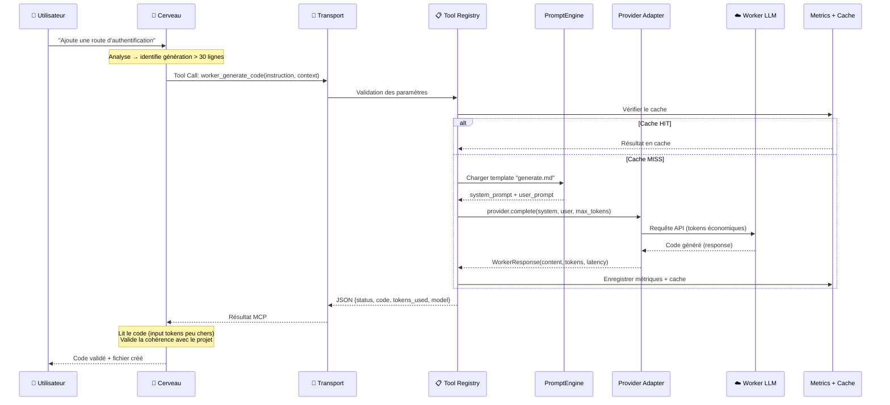
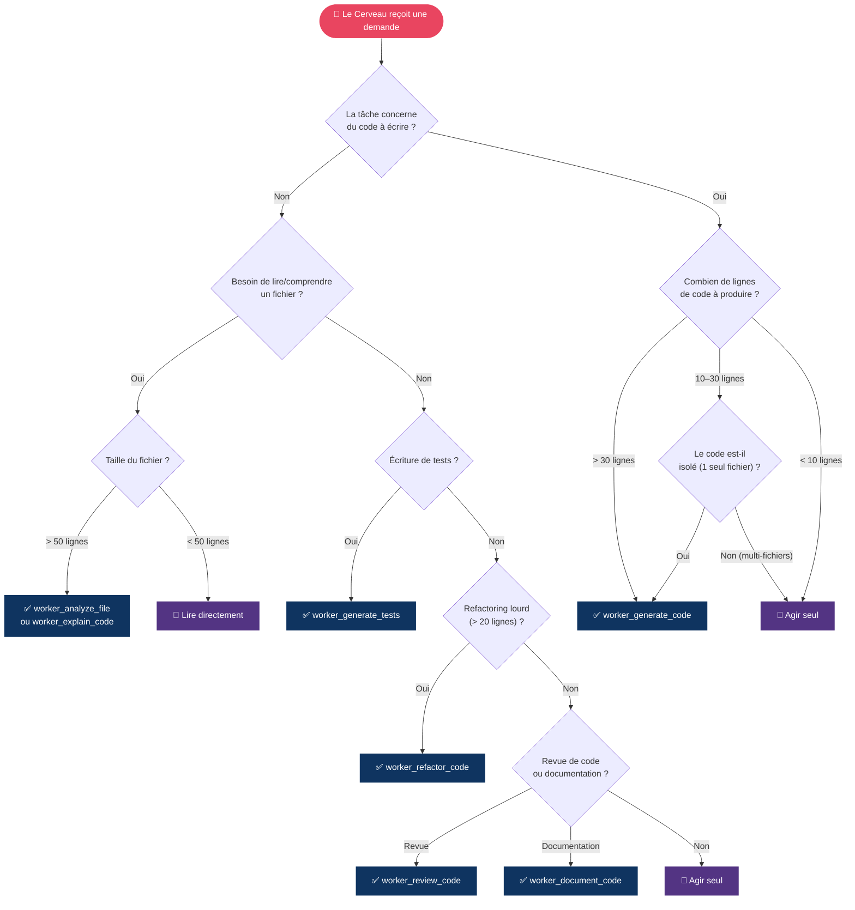
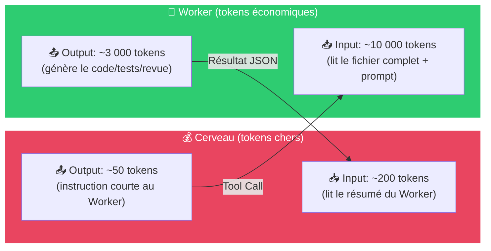
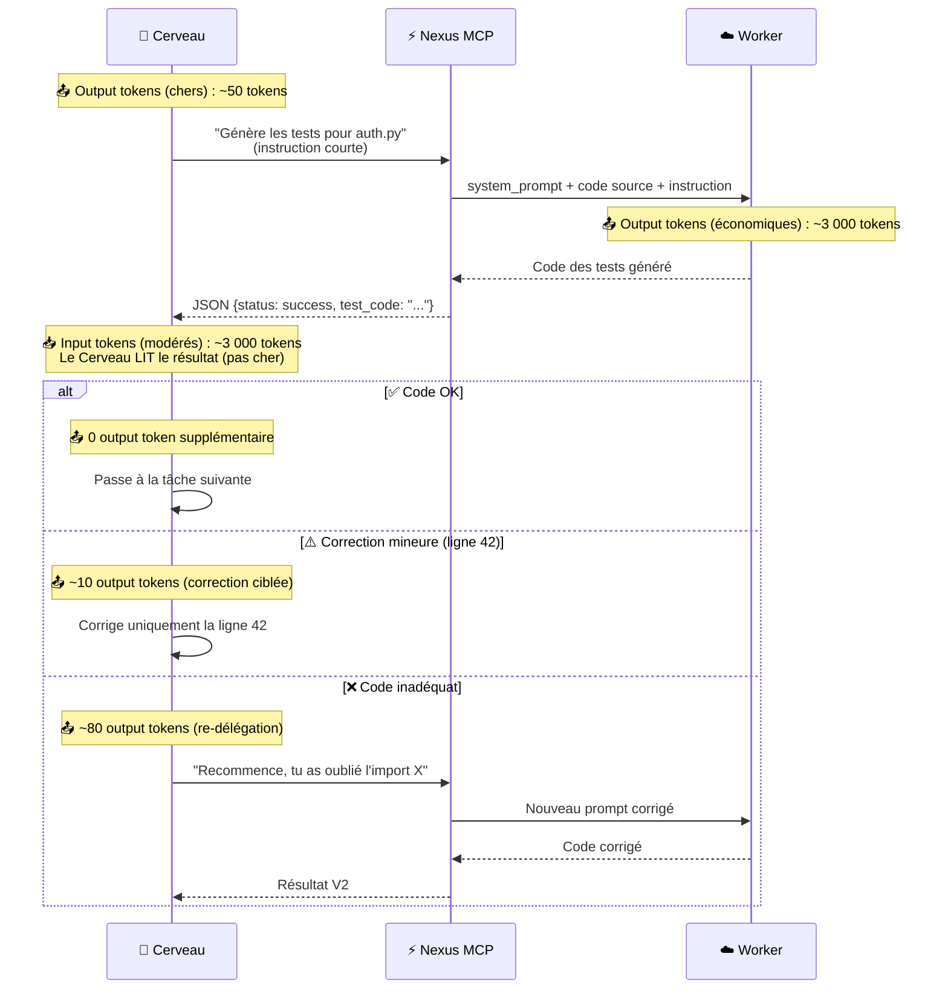

# Architecture — Nexus-Worker-MCP

## Vue d'ensemble

Nexus-Worker-MCP est un serveur MCP (Model Context Protocol) qui agit comme un **pont intelligent** entre un modèle principal coûteux (le Cerveau) et un modèle secondaire économique (le Worker). Il expose des outils MCP que le Cerveau appelle automatiquement pour déléguer les tâches lourdes en tokens.

L'architecture repose sur le pattern **Supervisor-Worker** (aussi appelé Planificateur / Exécuteur / Critique) : le Cerveau conserve la vision globale et les décisions d'architecture, tandis que le Worker exécute les tâches lourdes en tokens à moindre coût.

---

## Diagramme d'architecture global



---

## Séquence d'un appel outil

Ce diagramme montre le parcours complet d'un appel, de la demande utilisateur jusqu'à la réponse finale.



---

## Arbre de décision du Cerveau

Ce schéma illustre les règles de délégation. Le Cerveau prend ses décisions en fonction de la nature et du volume de la tâche.



### Matrice de décision (résumé)

| Situation | Seuil | Action du Cerveau |
|:---|:---|:---|
| Générer du code | > 30 lignes | → `worker_generate_code` |
| Lire / comprendre un fichier | > 50 lignes | → `worker_analyze_file` ou `worker_explain_code` |
| Modifier du code existant | > 20 lignes | → `worker_refactor_code` |
| Écrire des tests | Toujours | → `worker_generate_tests` |
| Évaluer la qualité / sécurité | Toujours | → `worker_review_code` |
| Ajouter des docstrings | Toujours | → `worker_document_code` |
| Mesurer les économies | À la demande | → `worker_get_metrics` |
| Corriger 1–5 lignes | < 10 lignes | → **Agir seul** |
| Décision d'architecture | — | → **Agir seul** |
| Planification du travail | — | → **Agir seul** |

---

## Flux des tokens : l'économie en détail

Ce diagramme montre **qui paie quoi** en tokens lors d'un appel typique.



### Pourquoi les seuils protègent le Cerveau

Le Cerveau est facturé **~50× plus cher** par token de sortie (output) qu'un worker comme GPT-4o-mini. Les seuils (30 lignes pour la génération, 20 lignes pour le refactoring) sont calibrés pour que le **coût de délégation** (formuler l'instruction + lire le résultat) reste toujours **inférieur** au coût de faire le travail soi-même.

- **En dessous du seuil** : Le surcoût de coordination (formuler le prompt, attendre, lire le résultat) dépasse l'économie. Le Cerveau agit seul.
- **Au-dessus du seuil** : L'économie de délégation est massive (60–95%).

---

## Pattern Reviewer-Critic : le flux optimal

Le workflow idéal pour maximiser à la fois la qualité et les économies suit le pattern **Reviewer-Critic**. Le Worker produit, le Cerveau supervise avec des corrections minimales et ciblées.



### Principes du pattern

1. **Le Worker écrit** — Il produit le code complet (tokens de sortie économiques).
2. **Le Cerveau lit** — Il reçoit le code en tokens d'entrée (3–5× moins chers que les tokens de sortie, même sur le modèle cher).
3. **Le Cerveau corrige chirurgicalement** — S'il y a un problème, il ne réécrit pas tout : il modifie uniquement les lignes concernées, minimisant ses tokens de sortie.

---

## Couches du système

### 1. Transport Layer (Couche de transport)

Gère la communication entre le client IDE et le serveur MCP.

| Mode | Usage | Description |
|---|---|---|
| **stdio** | Outils IDE locaux (VS Code, Anti-Gravity, Claude Code) | Le serveur est lancé comme un processus enfant. La communication passe par stdin/stdout. C'est le **mode par défaut**. |
| **HTTP/SSE** | Applications distantes, multi-utilisateurs | Le serveur écoute sur un port réseau. Utile pour le déploiement en équipe ou le cloud. |

Le mode de transport est choisi via la variable d'environnement `MCP_TRANSPORT`. En mode `stdio`, aucune configuration réseau n'est nécessaire. En mode `http`, le serveur se lie à l'adresse et au port définis dans la configuration.

### 2. Tool Registry (Registre des outils)

Chaque outil MCP est déclaré avec :
- Un **nom** unique (ex: `worker_generate_code`)
- Une **description** détaillée — c'est elle qui "programme" le Cerveau pour savoir quand déléguer
- Des **paramètres** typés avec validation automatique
- Un **handler** qui exécute la logique de délégation

Le Cerveau lit ces déclarations au début de la session et sait automatiquement quand appeler chaque outil grâce à leur description. Voir [tools-reference.md](tools-reference.md) pour le détail.

### 3. Provider Adapter Layer (Couche d'adaptateurs)

C'est le cœur de l'agnosticisme. Chaque fournisseur d'API implémente une **interface commune** définie par le protocole `WorkerProvider`. Cette interface impose trois méthodes :

- **complete** — Envoie un prompt au modèle worker et retourne une réponse standardisée
- **health_check** — Vérifie que le fournisseur est joignable et fonctionnel
- **get_info** — Retourne les métadonnées du provider (nom, modèle, endpoint)

Le choix de l'adaptateur est fait automatiquement via un **Factory Pattern** basé sur la variable d'environnement `WORKER_PROVIDER`. Voir [provider-adapters.md](provider-adapters.md) pour le détail.

**Adaptateurs prévus :**

| Adaptateur | Fournisseurs compatibles |
|---|---|
| OpenAI Adapter | OpenAI, Azure OpenAI, Groq, Together AI, vLLM |
| Anthropic Adapter | Anthropic Claude (API directe) |
| Gemini Adapter | Google Gemini (API directe) |
| Ollama Adapter | Modèles locaux via Ollama, LM Studio |
| Bedrock Adapter | AWS Bedrock (multi-modèles) |
| Custom Adapter | Tout endpoint HTTP personnalisé |

### 4. Core Services (Services de base)

| Service | Rôle |
|---|---|
| **PromptEngine** | Sélectionne et formate le template de prompt approprié selon le type de tâche. Les templates sont des fichiers Markdown stockés séparément. |
| **ErrorHandler** | Gère les retries avec backoff exponentiel, les timeouts, les fallbacks vers un provider de secours, et la protection anti-boucle infinie. |
| **MetricsCollector** | Comptabilise les tokens consommés (input/output), le temps de réponse, le taux de succès par outil, et le nombre d'appels par session. |
| **ResultCache** | Cache en mémoire avec TTL configurable. Élimine les appels redondants sur le même fichier non modifié. |
| **Logger** | Journal structuré de tous les appels pour le diagnostic, avec niveau configurable. |

---

## Structure du projet

```
Nexus-Worker-MCP/
├── README.md
├── pyproject.toml                # Config du package Python
├── .env.example                  # Template de variables d'environnement
├── .gitignore
│
├── src/
│   └── nexus_worker/
│       ├── __init__.py
│       ├── __main__.py           # Point d'entrée (python -m nexus_worker)
│       ├── server.py             # Serveur MCP principal
│       ├── config.py             # Chargement de la configuration (.env)
│       │
│       ├── tools/                # Outils MCP exposés au Cerveau
│       │   ├── __init__.py
│       │   ├── generate.py       # worker_generate_code
│       │   ├── analyze.py        # worker_analyze_file
│       │   ├── refactor.py       # worker_refactor_code
│       │   ├── explain.py        # worker_explain_code
│       │   ├── test.py           # worker_generate_tests
│       │   ├── review.py         # worker_review_code
│       │   └── document.py       # worker_document_code
│       │
│       ├── providers/            # Adaptateurs fournisseurs
│       │   ├── __init__.py
│       │   ├── base.py           # Interface WorkerProvider (Protocol)
│       │   ├── openai_.py        # OpenAI / Azure / Compatible
│       │   ├── gemini_.py        # Google Gemini
│       │   ├── anthropic_.py     # Anthropic Claude
│       │   ├── ollama_.py        # Modèles locaux
│       │   └── factory.py        # Factory d'instanciation
│       │
│       ├── prompts/              # Templates de prompts système
│       │   ├── __init__.py
│       │   ├── engine.py         # Moteur de sélection de prompt
│       │   └── templates/        # Fichiers .md de prompts
│       │
│       ├── core/                 # Services transversaux
│       │   ├── __init__.py
│       │   ├── errors.py         # Gestion d'erreurs, retry et fallback
│       │   ├── cache.py          # Cache de résultats en mémoire
│       │   ├── metrics.py        # Compteurs et statistiques
│       │   └── logger.py         # Logging structuré
│       │
│       └── utils/
│           ├── __init__.py
│           └── files.py          # Lecture/écriture de fichiers sécurisée
│
├── tests/
│   ├── conftest.py               # Fixtures pytest (mock provider, etc.)
│   ├── test_tools/
│   ├── test_core/
│   ├── test_providers/
│   └── test_prompts/
│
└── docs/                         # Ce dossier
```

---

## Flux d'exécution détaillé

### Séquence complète d'un appel outil

1. **L'utilisateur** envoie une demande au Cerveau (ex: "Ajoute une route d'authentification")
2. **Le Cerveau** analyse la demande, identifie qu'il s'agit de génération de code, et décide d'appeler `worker_generate_code`
3. **Le Transport Layer** reçoit l'appel d'outil via stdio ou HTTP et valide les paramètres
4. **Le Tool Handler** intercepte l'appel et prépare la requête
5. **Le ResultCache** vérifie si un résultat identique existe en cache — si oui, il est retourné immédiatement
6. **Le PromptEngine** sélectionne le template de prompt adapté (ex: `generate.md`) et y injecte l'instruction et le contexte
7. **Le Provider Adapter** formule la requête API selon le fournisseur configuré et l'envoie au Worker
8. **Le Worker** traite la demande et retourne le résultat
9. **L'ErrorHandler** vérifie le résultat — en cas d'erreur, il déclenche un retry avec backoff exponentiel ou un fallback vers un provider de secours
10. **Les Metrics** enregistrent les statistiques de l'appel (tokens, latence, statut)
11. **Le Transport Layer** renvoie le résultat épuré au Cerveau
12. **Le Cerveau** lit le code généré (opération peu coûteuse en tokens d'entrée), valide la cohérence, et présente le résultat à l'utilisateur

---

## Principes de conception

1. **Agnosticisme total** — Aucun module hors des adaptateurs ne référence un fournisseur spécifique
2. **Fail gracefully** — Si le Worker est indisponible, le MCP retourne un message clair au Cerveau, jamais un crash
3. **Observabilité** — Chaque appel est tracé avec ses métriques (tokens, latence, statut)
4. **Sécurité** — Les fichiers accessibles sont limités aux répertoires déclarés dans `ALLOWED_PATHS`
5. **Extensibilité** — Ajouter un outil ou un adaptateur = ajouter un fichier, pas modifier le core
6. **Économie par défaut** — Les seuils de délégation et le cache sont calibrés pour minimiser les coûts sans intervention manuelle
