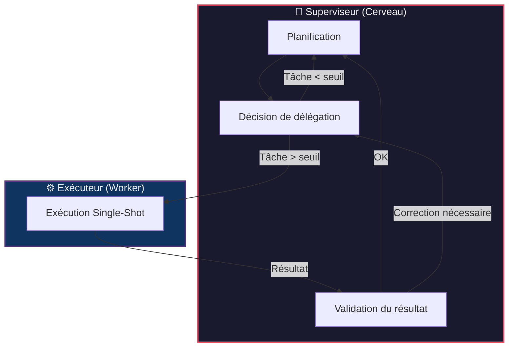
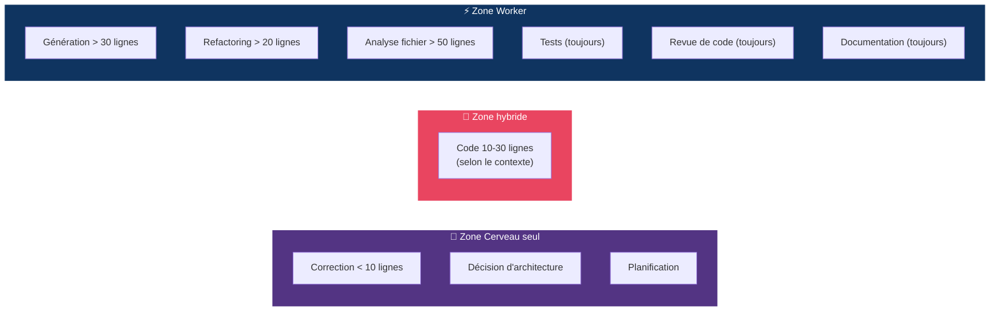
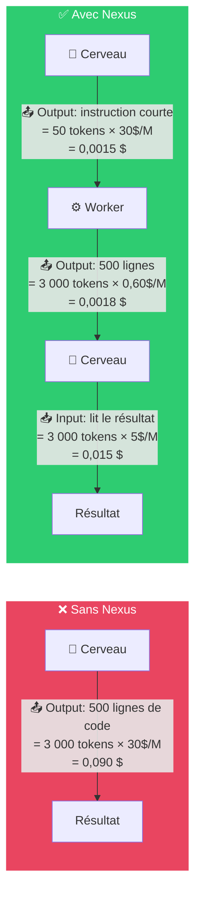
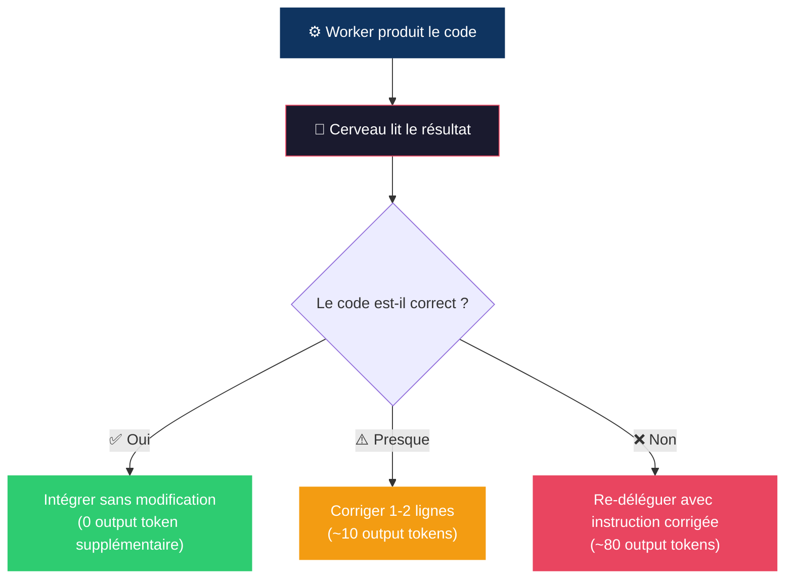
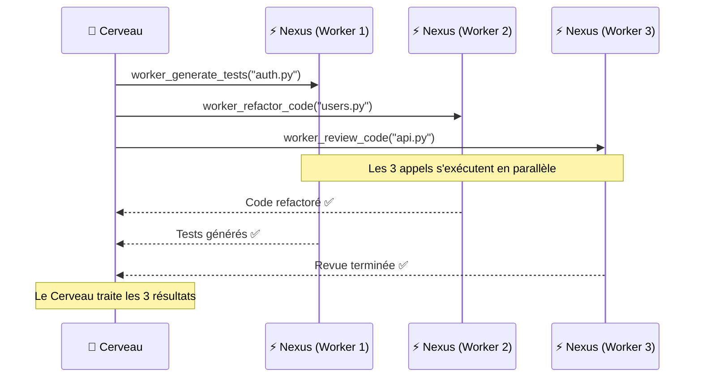
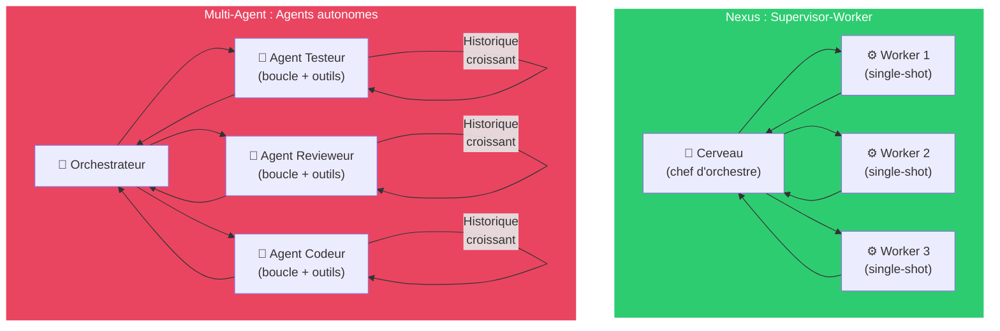
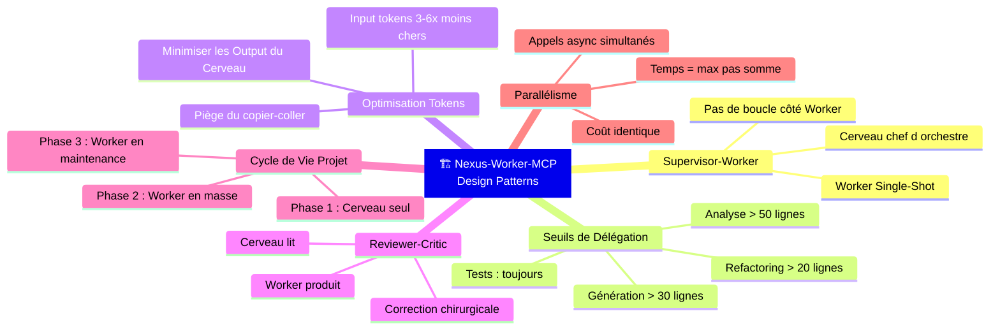

# Design Patterns & Stratégie de Délégation — Nexus-Worker-MCP

Ce document formalise les patterns architecturaux, les stratégies de délégation et les raisonnements théoriques derrière les choix de conception de Nexus-Worker-MCP. Il sert de référence pour comprendre **pourquoi** le système est conçu ainsi, et **comment** optimiser son utilisation.

---

## 1. Pattern Supervisor-Worker

Nexus-Worker-MCP implémente le pattern **Supervisor-Worker** (aussi appelé Routeur-Exécutant). C'est un modèle architectural reconnu dans les systèmes multi-agents.



### Caractéristiques clés

| Aspect | Choix de Nexus | Justification |
|:---|:---|:---|
| **Type de Worker** | Single-Shot (pas d'agent) | Prédictible, stable, parallélisable |
| **Boucle de raisonnement** | Côté Cerveau uniquement | Évite les dérapages de coût et les boucles infinies |
| **Outils propres au Worker** | Aucun | Le Worker produit du texte, il ne prend pas de décisions |
| **Mémoire du Worker** | Aucune (stateless) | Chaque appel est indépendant, pas de contexte qui s'accumule |

### Pourquoi pas des Workers "Agents" ?

Dans une architecture avec un Cerveau central, donner de l'autonomie (outils, mémoire, boucle de raisonnement) aux Workers comporte des risques :

- **Boucle infinie** — Un worker-agent qui s'auto-corrige peut tourner en boucle et consommer tout le budget.
- **Dérive de comportement** — Un worker-agent peut prendre des décisions contradictoires avec celles du Cerveau.
- **Explosion de tokens** — Chaque itération de la boucle agentic accumule du contexte (l'historique des actions précédentes), ce qui augmente exponentiellement les tokens d'entrée.
- **Imprévisibilité** — Le résultat d'un worker-agent est non-déterministe et difficile à auditer.

Le choix Single-Shot garantit : **1 instruction → 1 réponse → coût prévisible**.

---

## 2. Stratégie de Délégation

### Les seuils de délégation

Les descriptions des outils MCP programment le Cerveau pour savoir **quand** déléguer. Ces seuils sont calibrés pour que le surcoût de coordination (formuler le prompt, transmettre, lire le résultat) reste toujours **inférieur** au coût de faire le travail soi-même.



### Justification économique des seuils

Le point d'équilibre dépend du **ratio de prix** entre le Cerveau et le Worker :

| Modèle | Output / 1M tokens | Ratio vs GPT-4o-mini |
|:---|:---|:---|
| GPT-5.6 Sol (Cerveau) | 30,00 $ | **50×** |
| Gemini 3.1 Pro (Cerveau) | 12,00 $ | **20×** |
| GPT-4o-mini (Worker) | 0,60 $ | 1× |

**Calcul du point d'équilibre pour la génération de code :**

- **Coût de délégation** = tokens d'instruction du Cerveau (~50 tokens output × prix cher) + tokens de lecture du résultat (~N tokens input × prix cher) + tokens du Worker (~N tokens output × prix économique)
- **Coût sans délégation** = N tokens output × prix cher

Pour GPT-5.6 Sol → GPT-4o-mini, la délégation devient rentable dès **~15 lignes de code** (environ 150 tokens). Le seuil de 30 lignes intègre une marge de sécurité pour couvrir les cas où l'instruction doit être très détaillée.

---

## 3. Optimisation des Tokens : Input vs Output

### La règle fondamentale

> **Les tokens d'entrée (input) coûtent 3 à 6× moins cher que les tokens de sortie (output), quel que soit le modèle.**

| Modèle | Input / 1M tokens | Output / 1M tokens | Ratio Output/Input |
|:---|:---|:---|:---|
| GPT-5.6 Sol | 5,00 $ | 30,00 $ | **6×** |
| Gemini 3.1 Pro | 2,00 $ | 12,00 $ | **6×** |
| GPT-4o-mini | 0,15 $ | 0,60 $ | **4×** |

### Implication architecturale

Cette asymétrie de prix est **la raison fondamentale** de l'architecture Nexus :



**Résultat :**
- Sans Nexus : **0,090 $** (Output cher du Cerveau)
- Avec Nexus : **0,018 $** (Instruction + Worker + Lecture)
- **Économie : 80%**

### Le piège du "Copier-Coller" par le Cerveau

> ⚠️ **Attention** : Si le Cerveau doit réécrire le code du Worker pour le sauvegarder dans un fichier, il consomme autant de tokens de sortie (chers) que s'il avait écrit le code lui-même. L'économie est alors annulée.

**Workflow optimal (Reviewer-Critic) :**

1. Le Worker génère le code → **Output tokens économiques**
2. Le Cerveau lit le code → **Input tokens modérés**
3. Le Cerveau corrige uniquement les lignes problématiques → **Output tokens minimaux**

**Workflow sous-optimal :**

1. Le Worker génère le code → Output tokens économiques
2. Le Cerveau lit le code → Input tokens modérés
3. ❌ Le Cerveau réécrit tout le code pour le sauvegarder → **Output tokens très chers** (l'économie est perdue)

---

## 4. Qualité du Code : Cerveau seul vs Délégation

### Comparaison qualitative

| Critère | 🧠 Cerveau seul | ⚡ Délégation au Worker |
|:---|:---|:---|
| **Cohérence globale** | ★★★★★ — Vision complète du projet | ★★★☆☆ — Ne connaît que ce qu'on lui donne |
| **Qualité unitaire** | ★★★★☆ — Très bon | ★★★★★ — Excellent sur une tâche isolée |
| **Style uniforme** | ★★★★★ — Un seul "auteur" | ★★★☆☆ — Risque de styles différents |
| **Gestion des imports** | ★★★★★ — Connaît tout le projet | ★★☆☆☆ — Risque de réinventer l'existant |
| **Performance** | ★★★★☆ | ★★★★★ — Optimisé pour la tâche |

### Stratégies pour égaliser la qualité

#### A. Injection de Contexte

Toujours remplir le paramètre `context` des outils avec les conventions du projet :

```
❌ Mauvaise délégation :
"Crée une fonction qui formate une date."

✅ Bonne délégation (injection de contexte) :
"Crée une fonction qui formate une date.
Contexte : Dans ce projet, on utilise datetime standard,
on gère les erreurs avec try/except en loggant via
'from core.logger import logger', et on utilise le typage strict."
```

#### B. Partage de Squelettes (Stubs)

Inclure les signatures des fonctions et types existants pour éviter la duplication :

```
"Voici les interfaces existantes que tu dois utiliser :
- `def get_user(id: int) -> dict` (dans utils/users.py)
- `class AuthError(Exception)` (dans core/errors.py)
Ne réimplémente PAS ces fonctions, importe-les."
```

#### C. Revue par le Cerveau (Pattern Reviewer-Critic)

Le Cerveau agit comme un **Tech Lead** qui relit la Pull Request d'un développeur :



---

## 5. Stratégie de Démarrage de Projet

### Quand introduire le Worker ?

```mermaid
gantt
    title Cycle de vie d'un projet avec Nexus
    dateFormat  X
    axisFormat %s

    section Phase 1 : Fondations
    Architecture & conventions    :active, a1, 0, 3
    Fichiers de base (< 1000 LOC) :a2, 3, 6

    section Phase 2 : Mise à l'échelle
    Génération de code (Worker)    :crit, b1, 6, 10
    Tests unitaires (Worker)       :crit, b2, 8, 12
    Documentation (Worker)         :crit, b3, 10, 13

    section Phase 3 : Maintenance
    Refactoring (Worker)           :c1, 13, 16
    Revue de code (Worker)         :c2, 14, 17
    Analyse de fichiers (Worker)   :c3, 15, 18
```



| Phase | Cerveau seul ? | Worker ? | Justification |
|:---|:---|:---|:---|
| **Phase 1 : Fondations** (0–1 000 lignes) | ✅ Oui | ❌ Non | Le contexte est petit, le Cerveau doit poser les bases avec cohérence totale |
| **Phase 2 : Mise à l'échelle** (1 000+ lignes) | Supervision | ✅ Oui | Les conventions sont établies, le Worker peut produire en masse |
| **Phase 3 : Maintenance** | Décisions | ✅ Oui | Le Worker analyse, refactore et documente le code existant |

### Règle d'or

> **Le Cerveau pose l'architecture. Le Worker la remplit.**
>
> Ne déléguez jamais la création de la colonne vertébrale de votre application (la structure des dossiers, les interfaces, les conventions d'erreur). Déléguez le travail répétitif qui suit ces conventions.

---

## 6. Parallélisme Asynchrone

Les Workers Nexus étant des appels Single-Shot asynchrones (`async/await`), le Cerveau peut lancer **plusieurs tâches en parallèle** sans surcoût.



### Avantages du parallélisme

- **Temps total** = temps du Worker le plus lent (pas la somme)
- **Coût identique** — 3 appels parallèles coûtent autant que 3 appels séquentiels
- **Protection du contexte** — Le Cerveau ne charge pas les 3 fichiers dans sa mémoire en même temps

---

## 7. Comparaison avec les Alternatives

### Nexus (Supervisor-Worker) vs Multi-Agent complet



| Critère | Nexus (Supervisor-Worker) | Multi-Agent complet |
|:---|:---|:---|
| **Tokens consommés** | Prévisibles (1 aller-retour) | Imprévisibles (boucles multiples) |
| **Coût** | Bas et stable | Potentiellement élevé |
| **Latence** | Faible (~2-5 s par appel) | Variable (~10-60 s par agent) |
| **Qualité unitaire** | Très bonne | Excellente (auto-correction) |
| **Complexité** | Simple | Élevée |
| **Risque de dérapage** | Quasi nul | Élevé (boucles infinies) |
| **Cas d'usage idéal** | Tâches bien définies sur 1 fichier | Tâches complexes nécessitant de l'exploration |
| **Débogage** | Facile (1 prompt → 1 résultat) | Difficile (historique multi-tours) |

---

## Résumé


