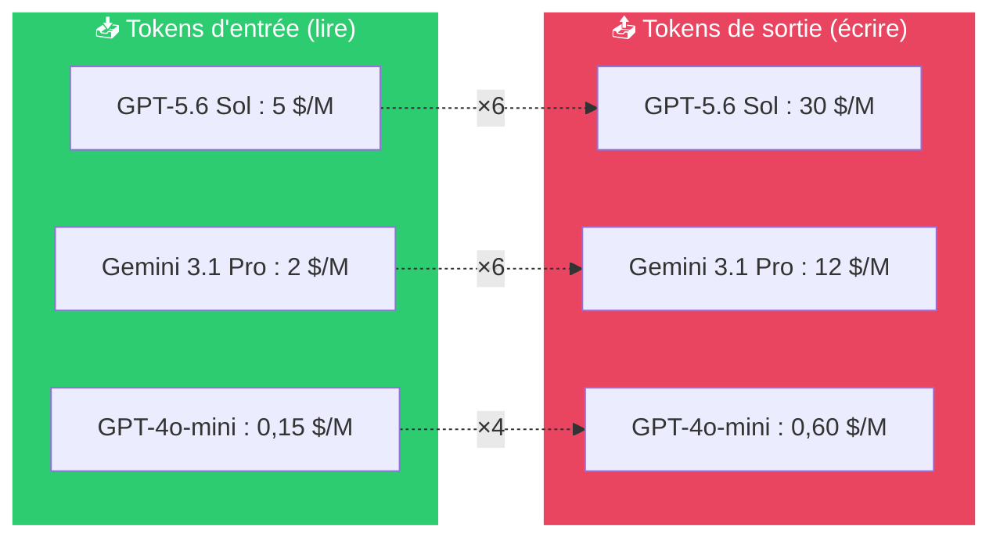
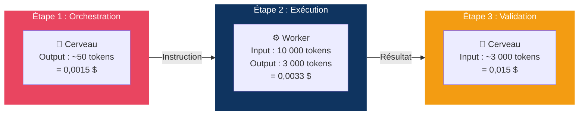
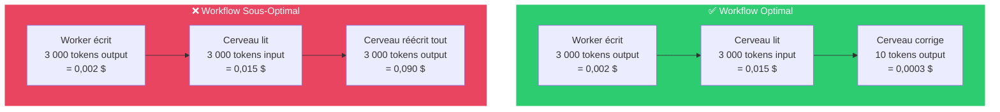
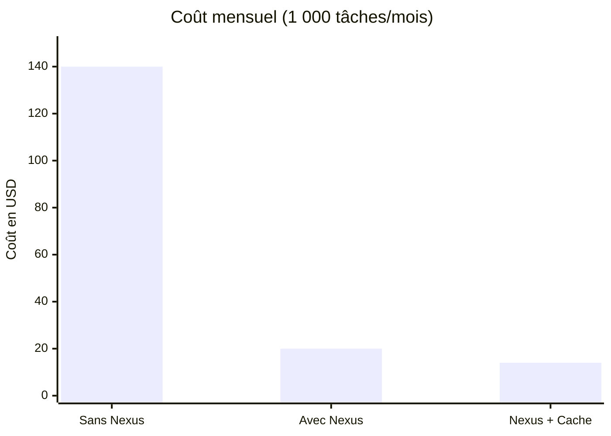

# Analyse FinOps — Nexus-Worker-MCP

Ce document présente une analyse financière de l'architecture **Nexus-Worker-MCP** comparée à une utilisation directe des modèles de pointe (état du marché juillet 2026). Il explique également comment mesurer vos économies en temps réel via l'outil `worker_get_metrics`.

---

## 1. Tarifs des modèles (pour 1 million de tokens)

### Modèles "Cerveau" — haute intelligence, coûteux

| Modèle | Input / 1M tokens | Output / 1M tokens |
|:---|:---|:---|
| GPT-5.6 Sol (OpenAI) | 5,00 $ | 30,00 $ |
| Claude 4.8 Opus (Anthropic) | 5,00 $ | 25,00 $ |
| Gemini 3.1 Pro (Google) | 2,00 $ | 12,00 $ |

### Modèles "Worker" — exécution rapide et économique

| Modèle | Input / 1M tokens | Output / 1M tokens |
|:---|:---|:---|
| GPT-4o-mini (OpenAI) | 0,15 $ | 0,60 $ |
| Gemini 2.0 Flash (Google) | 0,10 $ | 0,40 $ |
| Claude 3 Haiku (Anthropic) | 0,25 $ | 1,25 $ |
| Ollama (modèle local) | 0,00 $ | 0,00 $ |

### Asymétrie Input vs Output

> **Règle fondamentale** : Les tokens de sortie (output) coûtent **3 à 6× plus cher** que les tokens d'entrée (input), quel que soit le modèle.

Cette asymétrie est au cœur de la stratégie d'optimisation de Nexus. Le Cerveau doit **lire beaucoup** (input tokens modérés) mais **écrire peu** (output tokens très chers).

---

## 2. Cas pratique : génération de tests unitaires

**Scénario :** un développeur demande de lire un fichier source (10 000 tokens) et de générer une suite complète de tests (3 000 tokens).

### Sans Nexus — le Cerveau fait tout

Le Cerveau lit le fichier (10 000 input tokens) et génère les tests (3 000 output tokens).

| Cerveau utilisé | Coût Input | Coût Output | **Total** |
|:---|:---|:---|:---|
| GPT-5.6 Sol | 0,050 $ | 0,090 $ | **0,140 $** |
| Claude 4.8 Opus | 0,050 $ | 0,075 $ | **0,125 $** |
| Gemini 3.1 Pro | 0,020 $ | 0,036 $ | **0,056 $** |

### Avec Nexus — délégation au Worker

Le Cerveau ne voit que la consigne initiale (~500 tokens) et le résultat final. Le Worker traite le fichier complet et génère les tests.

| Étape | Modèle | Coût |
|:---|:---|:---|
| Instruction → Worker | Cerveau (GPT-5.6 Sol) — 50 output tokens | 0,0015 $ |
| Lecture + génération | Worker (GPT-4o-mini) — 10K input + 3K output | 0,0033 $ |
| Lecture du résultat | Cerveau (GPT-5.6 Sol) — 3K input tokens | 0,0150 $ |
| **Total** | | **0,020 $** |

**Facteur de réduction : 7× — soit 86 % d'économie.**

> **Note :** L'économie réelle varie entre 60 % et 95 % selon la proportion d'input vs output. Les tâches les plus rentables à déléguer sont celles qui génèrent beaucoup de tokens de sortie (tests, documentation, refactoring massif).

---

## 3. Le piège du "Copier-Coller"

> ⚠️ **Attention** : Si le Cerveau doit réécrire intégralement le code du Worker pour le sauvegarder, il consomme autant de tokens de sortie (chers) que s'il avait écrit le code lui-même.

| Workflow | Coût Cerveau Output | Coût Total | Économie vs sans Nexus |
|:---|:---|:---|:---|
| **Optimal** (correction ciblée) | ~0,0003 $ | **0,017 $** | **88 %** |
| **Sous-optimal** (réécriture complète) | 0,090 $ | **0,107 $** | **23 %** seulement |
| **Sans Nexus** (tout faire soi-même) | 0,090 $ | **0,140 $** | — |

### Comment rester optimal

1. **Le Worker produit le code** → tokens de sortie à bas prix
2. **Le Cerveau lit le résultat** → tokens d'entrée à prix modéré
3. **Le Cerveau ne corrige que les lignes problématiques** → tokens de sortie minimaux
4. **Ne jamais faire "copier-coller" du résultat complet** via le Cerveau

---

## 4. Impact du cache

Le cache en mémoire élimine complètement le coût des appels répétés sur le même fichier non modifié. Une revue de code ou une documentation demandée deux fois dans la même session ne consomme des tokens qu'une seule fois.

**Exemple — revue de code demandée 3 fois dans la même session :**

| Appel | Sans cache | Avec cache |
|:---|:---|:---|
| 1er appel | 0,007 $ | 0,007 $ |
| 2e appel (même fichier) | 0,007 $ | 0,000 $ |
| 3e appel (même fichier) | 0,007 $ | 0,000 $ |
| **Total** | **0,021 $** | **0,007 $** |

Sur une session de développement avec 30 % de requêtes répétées, le cache réduit la facture Worker d'environ 30 % supplémentaire.

---

## 5. Mesurer vos économies en temps réel

Nexus expose un outil `worker_get_metrics` qui retourne un rapport d'utilisation de la session en cours. Il fournit les données brutes pour calculer les économies.

Il retourne notamment :

- Le nombre total de tokens délégués au Worker (input et output séparés)
- Le nombre total d'appels et la latence moyenne
- Le taux de succès par outil
- Le taux de cache hits (proportion d'appels servis depuis le cache)

Pour l'appeler, demandez simplement au Cerveau en fin de session : *"Affiche-moi le rapport FinOps de la session."*

---

## 6. Retour sur investissement mensuel

| Architecture | Coût par tâche | Facture pour 1 000 tâches/mois |
|:---|:---|:---|
| Sans Nexus — GPT-5.6 Sol 100 % | 0,140 $ | **140,00 $** |
| Avec Nexus — GPT-5.6 + GPT-4o-mini | ~0,020 $ | **~20,00 $** |
| Avec Nexus + cache (30 % hit rate) | ~0,014 $ | **~14,00 $** |

L'économie mensuelle estimée est de **120 $ à 126 $ pour 1 000 tâches**, soit une réduction de 86 à 90 %.

L'architecture est rentabilisée dès la première heure d'utilisation. Les 15 minutes de configuration initiale sont amorties après 2 tâches déléguées.

---

## 7. Matrice de rentabilité par type de tâche

Toutes les tâches ne génèrent pas la même économie. Voici la rentabilité par outil :

| Outil | Input Worker | Output Worker | Économie typique | Commentaire |
|:---|:---|:---|:---|:---|
| `worker_generate_tests` | Élevé | Très élevé | **90–95 %** | Tâche la plus rentable (beaucoup d'output) |
| `worker_document_code` | Élevé | Très élevé | **90–95 %** | Idem, génère beaucoup de docstrings |
| `worker_generate_code` | Faible | Élevé | **80–90 %** | Rentable dès 30 lignes |
| `worker_refactor_code` | Élevé | Élevé | **75–85 %** | Le fichier source est gros en input |
| `worker_review_code` | Élevé | Modéré | **70–80 %** | La revue est plus courte que le code source |
| `worker_explain_code` | Élevé | Modéré | **70–80 %** | L'explication est souvent concise |
| `worker_analyze_file` | Très élevé | Faible | **60–70 %** | Le gain est surtout sur les input tokens |

---

## 8. Conseils pour maximiser les économies

- **Garder le cache activé** — il est actif par défaut et réduit significativement la facture sur les sessions longues.
- **Augmenter le TTL du cache** si vos sessions dépassent une heure (variable `CACHE_TTL_SECONDS`).
- **Choisir le bon Worker** — Gemini 2.0 Flash est actuellement le moins cher pour les tâches de génération standard.
- **Configurer `ALLOWED_PATHS` précisément** — limiter les chemins autorisés évite d'exposer des fichiers volumineux inutiles.
- **Consulter les métriques régulièrement** — le rapport FinOps permet d'ajuster la stratégie de délégation en fonction des coûts réels.
- **Toujours remplir le paramètre `context`** — Cela aide le Worker à produire un code correct du premier coup, évitant des re-délégations coûteuses.
- **Éviter le piège du copier-coller** — Si le Cerveau réécrit intégralement le code du Worker, l'économie est annulée. Préférer les corrections ciblées.
- **Exploiter le parallélisme** — Lancer plusieurs outils en parallèle ne coûte pas plus cher, mais réduit le temps total.
