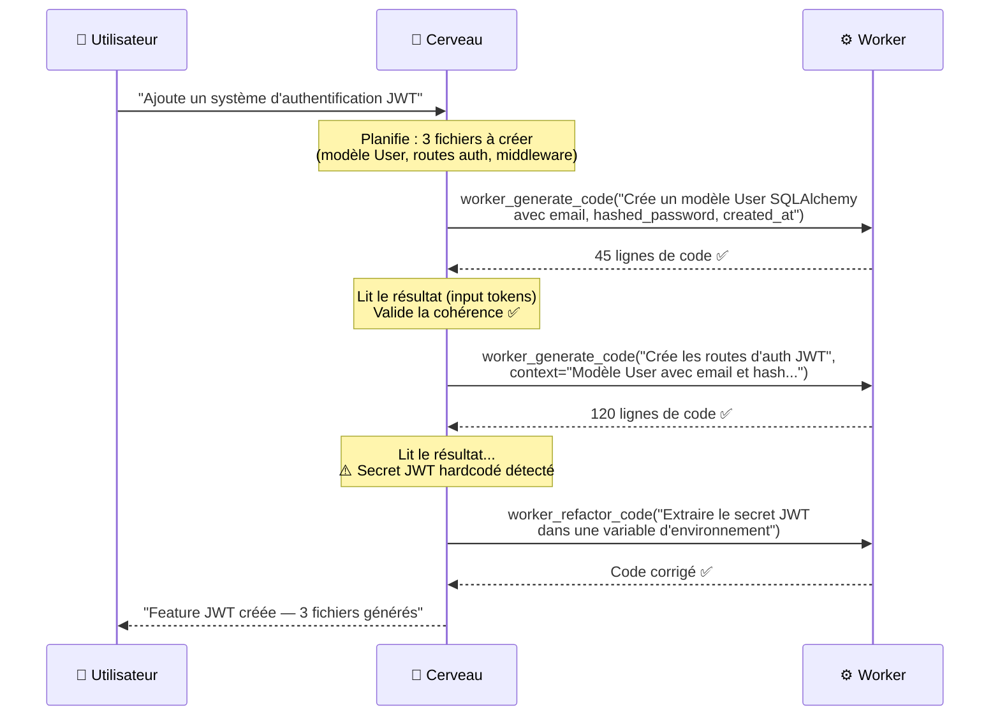
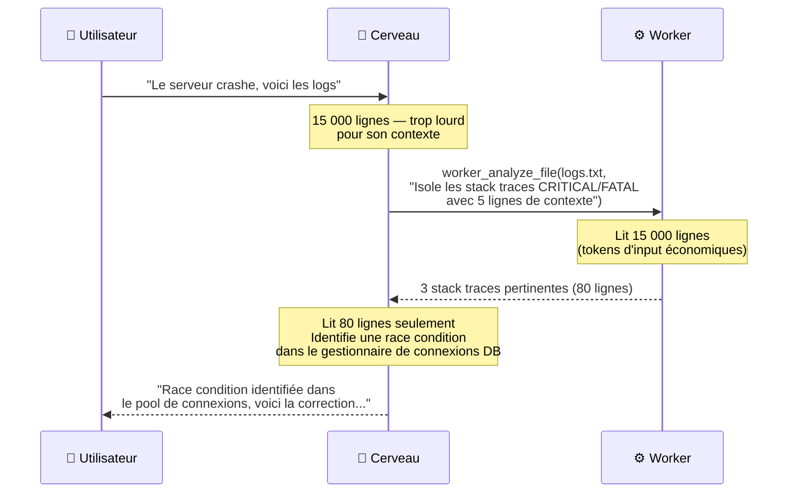
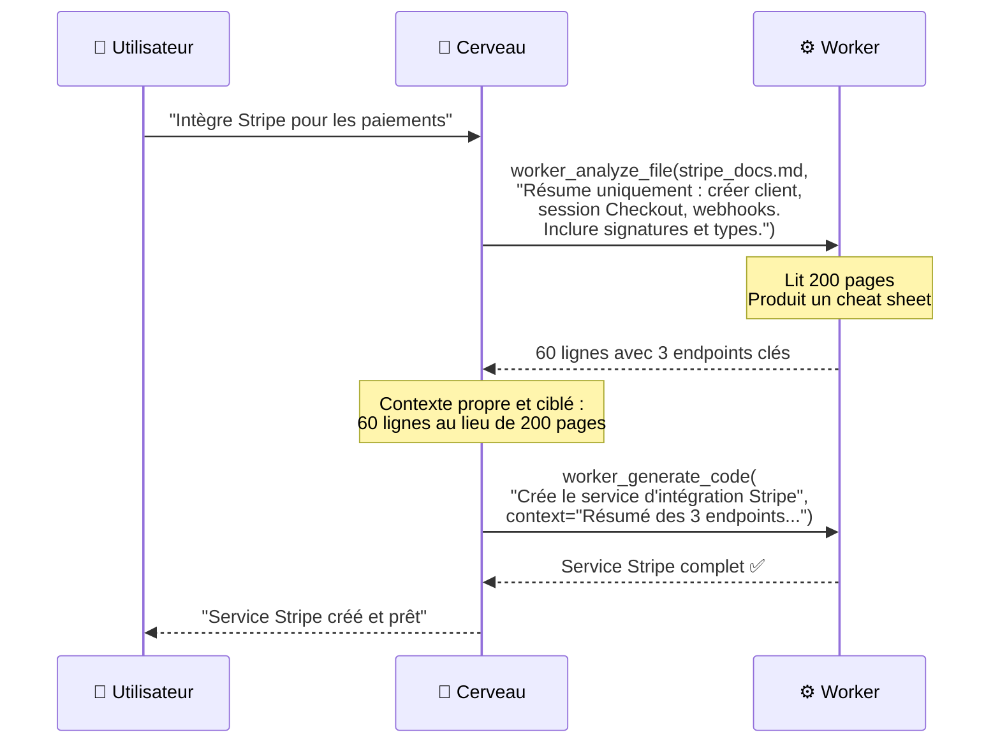
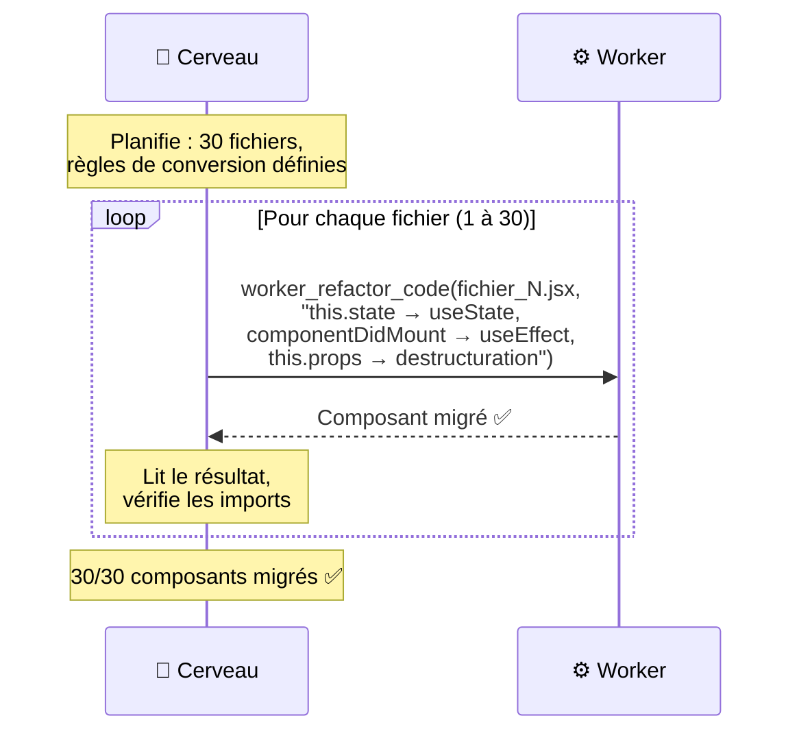
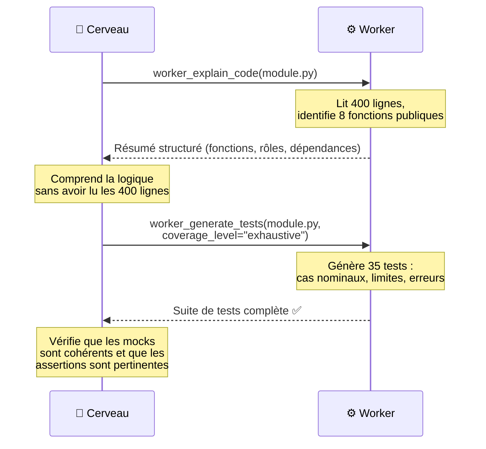
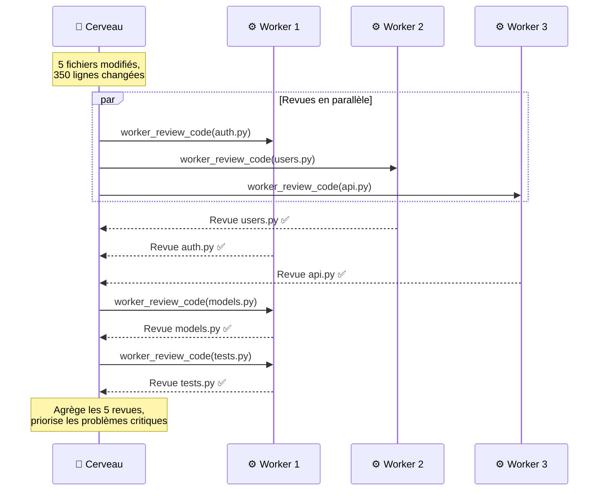
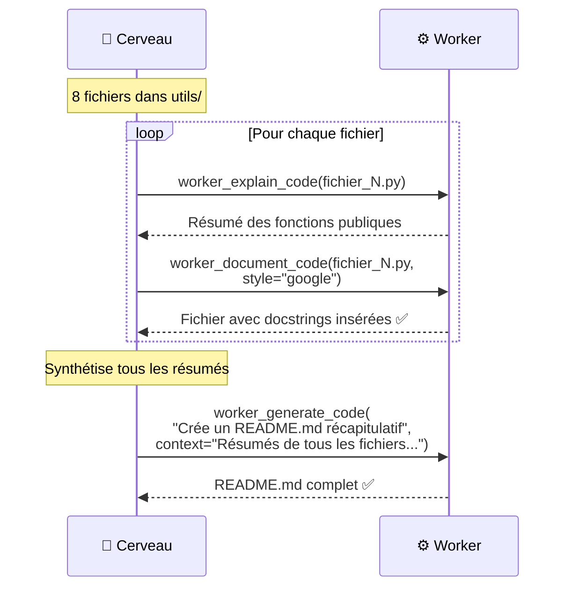

# Scénarios d'Usage — Nexus-Worker-MCP

Ce document décrit les cas d'utilisation concrets du système, avec les flux d'interaction détaillés entre le Cerveau, le MCP et le Worker.

> Pour comprendre les principes de conception derrière ces scénarios, consultez [design-patterns.md](design-patterns.md).

---

## Scénario 1 : Création d'une feature complète

**Contexte :** L'utilisateur demande d'ajouter un système d'authentification JWT à une API FastAPI existante.

### Flux d'interaction

### Économie réalisée

| Sans Nexus | Avec Nexus |
|---|---|
| Le Cerveau génère ~165 lignes (Output très cher) | Le Cerveau ne génère que ~3 instructions courtes |
| Coût Output Cerveau : ~0,148 $ | Coût Output Cerveau : ~0,005 $ |

### Pattern appliqué

Ce scénario illustre le **Reviewer-Critic** : le Cerveau délègue, lit les résultats, détecte un problème (secret hardcodé), et re-délègue une correction ciblée plutôt que de réécrire tout le fichier.

---

## Scénario 2 : Analyse et debug de logs massifs

**Contexte :** Un serveur de production crashe. Le fichier de logs fait 15 000 lignes.

### Flux d'interaction

### Économie réalisée

- **15 000 lignes** jamais envoyées au modèle cher
- Le Worker encaisse ~45 000 tokens d'input sur l'API économique
- Le Cerveau ne traite que **80 lignes** pertinentes → économie de **95%+ des tokens**

### Pattern appliqué

Ce scénario illustre la **protection de contexte** : le Worker agit comme un filtre qui réduit l'information brute en un résumé actionnable pour le Cerveau.

---

## Scénario 3 : Compression de documentation (RAG économique)

**Contexte :** L'utilisateur veut intégrer l'API Stripe. La doc officielle fait 200 pages.

### Flux d'interaction

### Point clé

Le Cerveau n'a jamais vu les 200 pages de documentation Stripe. Son contexte reste propre et ciblé, ce qui améliore la qualité de ses décisions architecturales.

---

## Scénario 4 : Migration de framework

**Contexte :** Migrer 30 composants React de Class Components vers Functional Components (hooks).

### Flux d'interaction

### Point d'attention

Pour les migrations multi-fichiers, le Cerveau maintient un **registre de progression** pour ne pas perdre le fil. La boucle est gérée par le Cerveau, pas par le Worker — c'est le principe fondamental du pattern **Supervisor-Worker**.

### Opportunité de parallélisme

Les 30 fichiers étant indépendants, le Cerveau peut lancer **plusieurs refactorings en parallèle** :

```mermaid
gantt
    title Migration parallélisée (3 Workers simultanés)
    dateFormat s
    axisFormat %S s

    section Worker 1
    Fichier 1   :a1, 0, 3
    Fichier 4   :a2, 3, 6
    Fichier 7   :a3, 6, 9

    section Worker 2
    Fichier 2   :b1, 0, 4
    Fichier 5   :b2, 4, 7
    Fichier 8   :b3, 7, 10

    section Worker 3
    Fichier 3   :c1, 0, 3
    Fichier 6   :c2, 3, 7
    Fichier 9   :c3, 7, 10
```

---

## Scénario 5 : Génération de tests exhaustifs

**Contexte :** Un module métier de 400 lignes n'a aucun test.

### Flux d'interaction

### Pattern appliqué

Ce scénario combine deux patterns :
1. **Protection de contexte** : `worker_explain_code` permet au Cerveau de comprendre le module sans le charger
2. **Délégation systématique des tests** : La génération de tests est toujours déléguée (forte production d'output tokens)

---

## Scénario 6 : Revue de code automatisée (Code Review)

**Contexte :** L'utilisateur pousse un commit et veut une revue de qualité avant la PR.

### Flux d'interaction

### Point clé : le cache en action

Si l'utilisateur relance la revue sur le même fichier sans modification, le cache retourne le résultat instantanément (0 token, 0 latence).

---

## Scénario 7 : Documentation automatique

**Contexte :** Générer la documentation d'un module entier (docstrings + README).

### Flux d'interaction

---

## Tableau récapitulatif

| # | Scénario | Outils utilisés | Pattern principal | Gain estimé |
|---|---|---|---|---|
| 1 | Création de feature | `generate` + `refactor` | Reviewer-Critic | 80–90% tokens |
| 2 | Debug de logs | `analyze` | Protection de contexte | 95%+ tokens |
| 3 | Compression doc | `analyze` + `generate` | Protection de contexte | 85% tokens |
| 4 | Migration framework | `refactor` (boucle parallèle) | Parallélisme | 75% tokens |
| 5 | Génération de tests | `explain` + `generate_tests` | Délégation systématique | 90% tokens |
| 6 | Code review | `review` (parallèle + cache) | Parallélisme + Cache | 70–80% tokens |
| 7 | Documentation | `explain` + `document` + `generate` | Pipeline séquentiel | 85% tokens |
